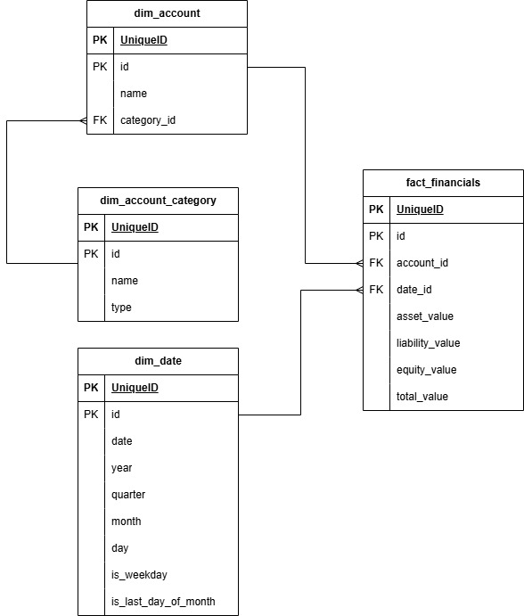

# Task 1. Data Modeling 
Create an entity relationship diagram (ERD) that represents the structure for the balance sheet 
data provided in the JSON file attached.

## In your terminal CD into the project folder

## Set up virtual environment in the project folder

    `python -m venv .venv`

Activate the environment: 

For Linux/MacOS:

    `source .ven/bin/activate` 

For Windows:

    `.venv/Scripts/Activate.ps1` 

## Install dependencies

    `pip install -r requirements.txt`

## Parse Json and Review as dataframes 

    `python ./Scripts/parse.json.py`

## Analyze the data

The provided data is a balance sheet structure in JSON format. A balance sheet is a financial statement that summarizes a company’s financial position at a specific point in time. It is divided into three main categories: Assets, Liabilities, and Equity. The data structure represents this balance sheet and organizes the information in a nested manner.

### Breakdown of the JSON Structure:

1. Assets Section
    
    Assets are divided into:
        Account ID:
        Name: 
        Value:
        Items: 

    Subcategories or specific items under each asset has:
        Current Assets:
        Bank Accounts: 
        Accounts Receivable:
        Other Current Assets: 
        Fixed Assets: 
        Property, Plant, and Equipment: 

2. Liabilities Section:

    The liabilities section is  broken down into two categories:
        Account ID:
        Name:
        Value: 
        Items:

    Subcategories or specific items under each liability category.
        Current Liabilities:
        Accounts Payable: 
        Credit Cards: 
        Long-Term Liabilities: 
        Settle Loans Payable: 

3. Equity Section

    Each equity entry has:
        Account ID : 
        Name:
        Value: 
        Items:

    Subcategories or specific items under each equity section  contains:
        Owners Equity: 
        Retained Earnings:
        Balance Adjustments: 
        Net Income: 

## Design Data Model

The fact table will contain the key financial values that are being analyzed or aggregated. This table will reference dimension tables through foreign keys.

1. fct_financials
    Contains aggregated values for assets, liabilities, and equity.
    Contains foreign keys referencing the dim_account, dim_date, and dim_account_category dimension tables.

Dimension tables will contain the descriptive information related to the facts. Here, we’ll create dimension tables for accounts, dates, and categories.

1. dim_account
    Describes the financial accounts like "Bank Accounts", "Receivables".
2. dim_date
    Provides time dimensions (date, year, month, quarter)
3. dim_account_category
    Provides categories like "Current Assets", "Fixed Assets", "Equity".

### Relationships and Cardinality

The fact table fact_financials will have:
    A one-to-many relationship with the dim_account table, as multiple records in the fact table can reference the same account.

    A one-to-many relationship with the dim_date table, as multiple records in the fact table can reference the same date.

The dim table dim_account will have:
    A one-to-many relationship with the dim_account_category table, as multiple records in the dim table can reference the same account category. Indirectly  fact_financials table will have one-to-many relationship with the dim_account_category table.

## Overview of the data model

This star schema will allow for efficient querying and aggregation of financial data by different dimensions (e.g., by account, by time, by category). It is a common design for a data warehouse.

### Benefits of Using Dimensions in dim tables such as category_id in dim_account Table:

1. Normalization:

By using category_id (which is a foreign key to the dim_account_category table), I followed the principles of normalization. This reduces redundancy and ensures that each account's category is stored only once in the dim_account_category table, rather than repeatedly in the dim_account table.

2. Data Integrity:

Using a category_id ensures data integrity, meaning that the account’s category is tied to a single source of truth in the dim_account_category table. If I need to update the category name (e.g., changing “Fixed Assets” to “Long-Term Assets”), you can do it in one place without modifying multiple rows in the dim_account table.

3. Performance:

Using an integer-based foreign key (category_id) is typically more performance-efficient than storing text values like the category name. This will reduce the storage space required and improve query performance, especially in large data sets.

4. Scalability:

As this model grows and more categories are added, using category_id ensures that the model can scale without needing to update each account record individually. The dim_account_category table can be expanded independently with new categories.

## Same principles applies to other dimension tables.

## ERD

